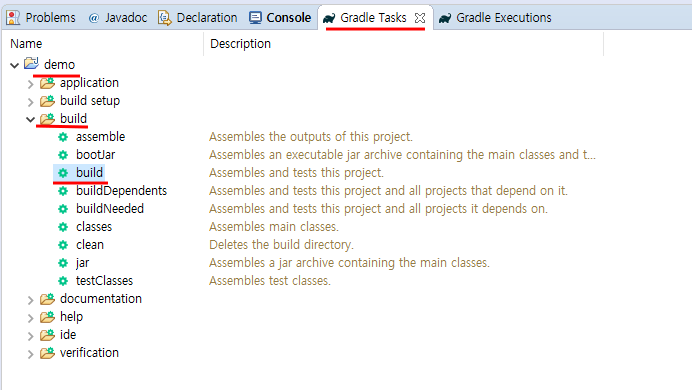
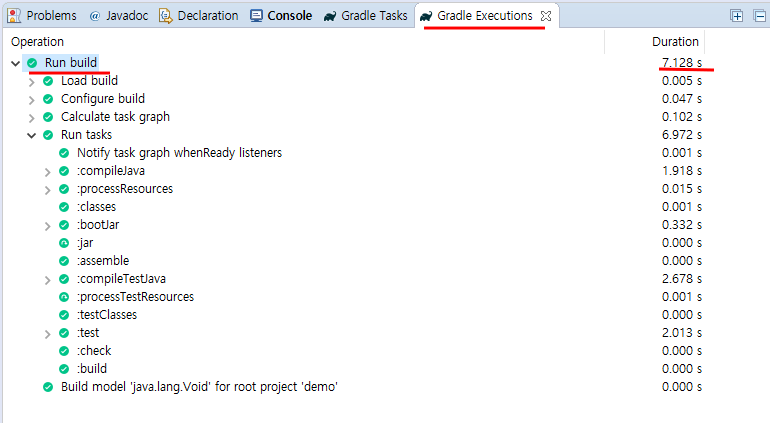
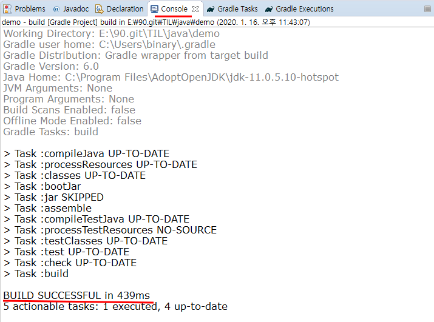

# STS Spring boot Project Import

1. import project
    - Import button

    

    - [File] - [Import]

    

    - [Right click] - [Import]

    

2. [Gradle] - [Existing Gradle Project]

    

3. Import Path Select

    

4. Test Running

    - [Project Right Click] - [Run As] - [Spring Boot App]

    
    
    - [check console]

    

5. Gradle build

    - [Gradle Tasks] - [project name] - [build] - [build] - [Double Click]

    

    - [Gradle Executions]

    

    - [Console]

    
