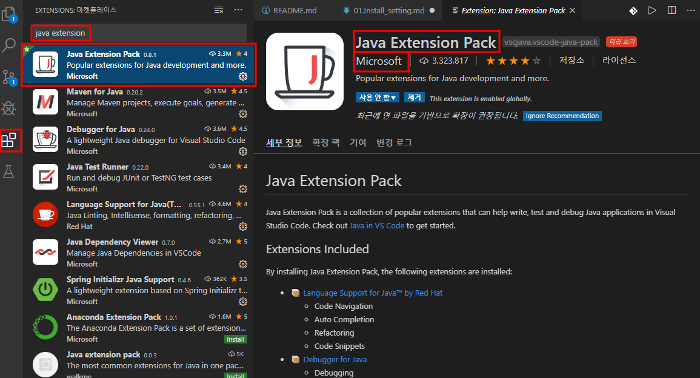
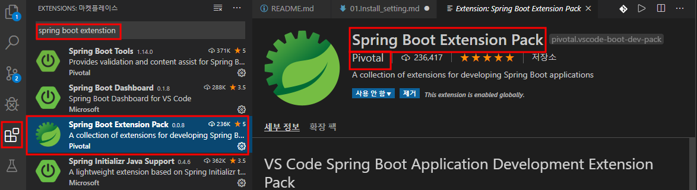
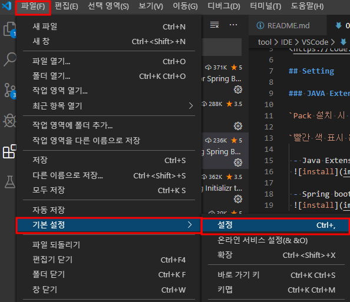
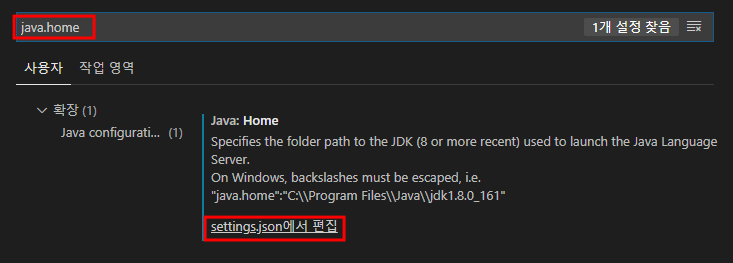
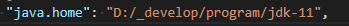

# VSCode Install

## Download

<https://code.visualstudio.com/>

## Setting

### JAVA Extension Install

`Pack 설치 시 Dependence 로 잡힌 다른 확장 모듈도 같이 설치가 되어 편리 하다.`

`빨간 색 표시 된 부분을 확인 하여 설치 한다.`

 - Java Extension Pack install
 

 - Spring boot Extension Pack install
 

### java.home setting

`JDK 설치 경로를 잡아 준다.`

`System Path 에 등록 할 수 있고, 설정 정보를 변경 해도 된다.`

1. Open setting configuration

    ```
    메뉴 파일 -> 기본 설정 -> 설정
    ```

    

    을 선택하 거나

    ```
    ctrl + ,
    ```

    단축키 로 열 수 있다.

2. edit custom setting

    검색 입력 칸에 java.home 을 입력 하여 설정 값을 확인 한다.
    

    settings.json에서 편집을 눌러 실행할 자바 버전의 경로를 넣어준다.
    ```
    "java.home": "<path>"
    ```
    

