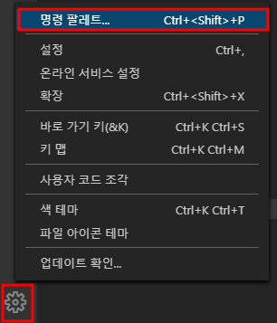
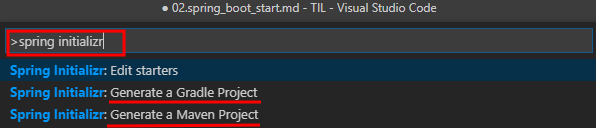
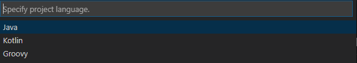
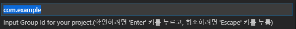
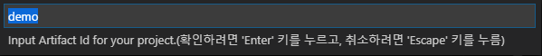
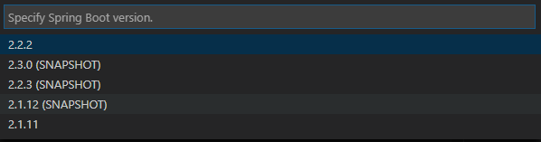
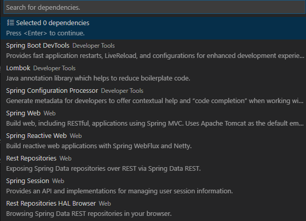
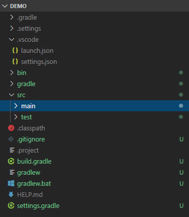
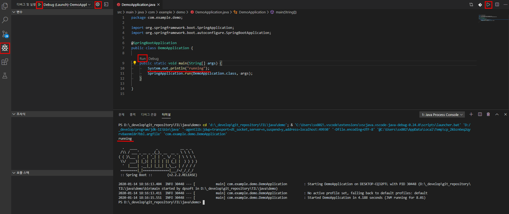

# Spring boot Project

<https://code.visualstudio.com/docs/java/java-spring-boot>

1. 명령 팔레트를 열어 `spring initializ` 로 검색

    하단 관리 -> 명령 팔레트
    
    혹은 
    ```
    ctrl + shift + p
    ```

    

2. maven or gradle 선택 - [ gradle 선택 ]

    

3. project language 선택 - [ java 선택 ]

    

4. group id 입력 ( com.example 입력 - default )

    

5. artifact 입력 ( demo 입력 - default )

    

6. spring boot version 선택 ( 2.2.2 선택 )

    

7. dependencies 선택

    

8. export 할 폴더 선택

9. package 폴더 열기

    `gradle 로 dependency 패키지 다운 로드 및 시간이 소요 될 수 있다.`

    

10. 실행

    `임시 코드를 넣고 실행.`

    `왼쪽 디버그 창에서 실행 할 수 있고, 메인 함수 위에 Run | Debug 버튼을 눌러 실행 할 수도 있고, 오른쪽 상단의 실행 버튼을 눌러서 실행 할 수 도 있다.`

    
